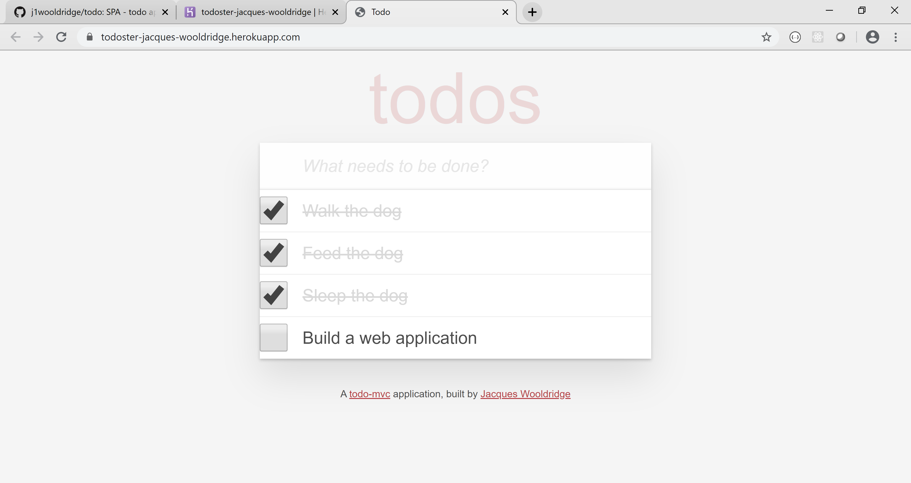

# README

Todo is a single-page to-do application features a fluid user interface that by using JavaScript
allows users to rapidly add dynamic content.

Deployed Version

Visit https://todoster-jacques-wooldridge.herokuapp.com/ to deploy the app.

Screenshot Version

 

Jacques Wooldridge.